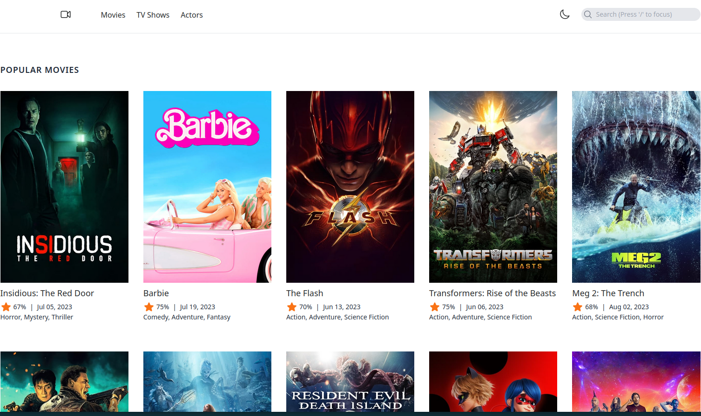

## Movie App 

laravel 10 Movie App  with docker, Tailwindcss, livewire and Alpine js.

## Demo

    https://drive.google.com/file/d/1Yx18xzZGwnNT7PT02mJUDxct_K8KX2FR/view?usp=sharing

## Installation with docker

1.Clone the project

    git clone https://github.com/Moyhe/Movies_App.git

2.Run composer install

Navigate into project folder using terminal and run

    docker run --rm \
    -u "$(id -u):$(id -g)" \
    -v "$(pwd):/var/www/html" \
    -w /var/www/html \
    laravelsail/php82-composer:latest \
    composer install --ignore-platform-reqs

3.Copy .env.example into .env

    cp .env.example .env

4.Don't forget to set your TMDB_TOKEN in your .env file. You can get an API key from dashboard  founded [here](https://www.themoviedb.org/).

5.Start the project in detached mode

    ./vendor/bin/sail up -d

From now on whenever you want to run artisan command you should do this from the container.
Access to the docker container

    ./vendor/bin/sail bash

6.Set encryption key

    php artisan key:generate --ansi

## Features

1. searching for movies
2. backToTop button
3. theme switcher
4. infinite scroll
5. movies, tv shows and actors pages with details for each

